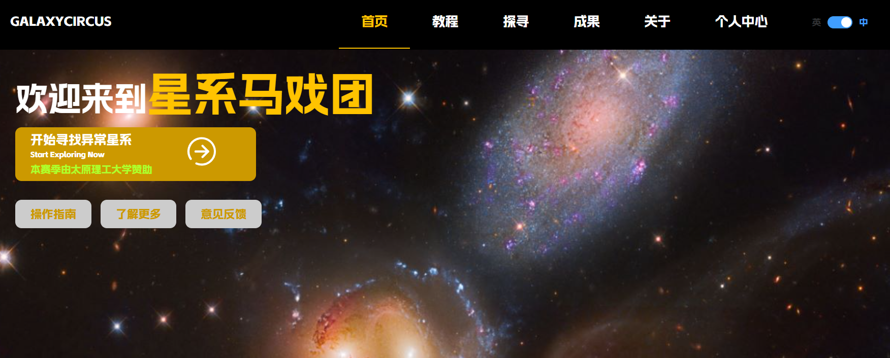

# GalaxyCircus: Rapid Anomaly Galaxy Identification Public Science Platform

[GalaxyCircus](https://nadc.china-vo.org/galaxycircus/) is a public science project dedicated to the rapid identification of anomalous galaxies. It ingeniously combines machine learning technology with the collaborative effect of public science to address the challenges of processing large-scale astronomical data. 

## Repository Overview

This repository is used to store anomalous celestial object candidates discovered by the GalaxyCircus platform. These candidates are jointly selected by citizen scientists and machine learning algorithms, representing galaxies that may have unique features or unresolved mysteries. Each entry includes detailed observational information and preliminary analysis results for further study and discussion.

### Update Progress

- **2025.2.18**: Uploaded all anomalous celestial object candidates annotated via the web up to January 1, 2025. 

## How to Participate

Whether you are a professional astronomer or a curious enthusiast about the universe, GalaxyCircus welcomes you to join this exciting journey of exploration. Visit our [official website](https://nadc.china-vo.org/galaxycircus/) for more information and start contributing!

## Contact Us

If you have any questions or suggestions, please feel free to contact us through the following channels:
- Email: lvjiameng1224@link.tyut.edu.cn 
- GitHub Issues

Let's work together to unveil the secrets hidden deep within the cosmos!
